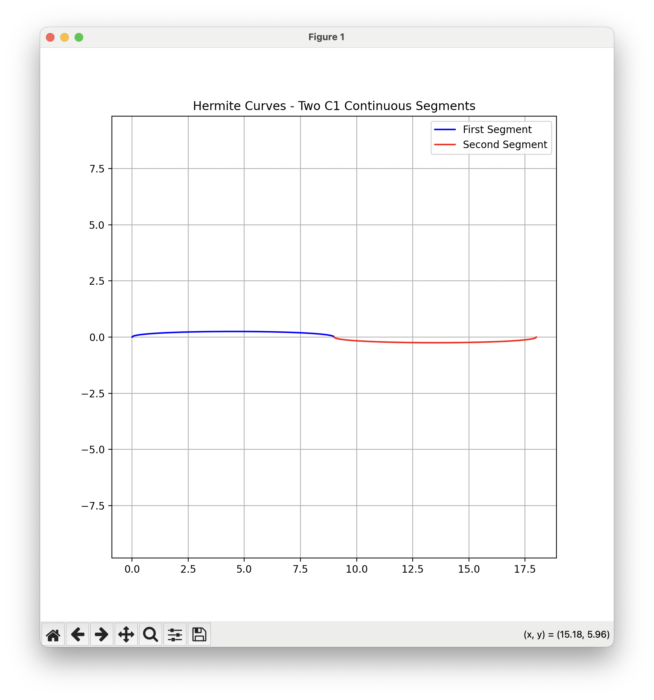

# Exercise 1 Hermite Curve
```bash
P = GMQ
G (Geometric Matrix): This is the transformation matrix that defines what kind of geometric hcange we want to apply to the curve.
M (Modeling Matrix): This defines how we want to model our curve.
Q (Control Points): This is the matrix that contains the control points of the curve.
```
We see the blue segment starts at (0,0) and end at (9,0) with a positive tangent in the beginning and end with a dip. The red segment starts at (9,0) and ends at (18,0) with a negative tangent in the beginning and end with a rise.
```bash

# This is the Hermite basis matrix that defines how the curve behaves. It's used to blend the control points and tangents.
M = np.array([
    [2, -3, 0, 1],    # Hermite basis matrix
    [-2, 3, 0, 0],
    [1, -2, 1, 0],
    [1, -1, 0, 0]
])

# Points and tangents for first curve
G1 = np.array([
    [0, 9, 0, 0],     # x coordinates and tangents
    [0, 0, 1, -1]     # y coordinates and tangents
])

# Points and tangents for second curve
G2 = np.array([
    [9, 18, 0, 0],
    [0, 0, -1, 1]
])

# Creates powers of t: [t³, t², t, 1]
Q = np.vstack([t**3, t**2, t, np.ones_like(t)])

```    


These M matrix numbers aree derived from solving a system of constraints that we want our Hermite curve to satisfy. Here are the key constraints:

1. Position Constraints:
    - When t=0, curve must be at P0   
    - When t=1, curve must be at P1

2. Tangent Constraints:
    - When t=0, curve's derivative must match T0
    - When t=1, curve's derivative must match T1

The key thing to notice is C1 continuity at the joint:
- The curves meet perfectly (position continuity - C0)
- Their tangents match at the joining point (derivative continuity - C1)

This is achieved by making sure:
- The end point of first curve equals start point of second curve
- The end tangent of first curve equals start tangent of second curve (but in opposite directions)